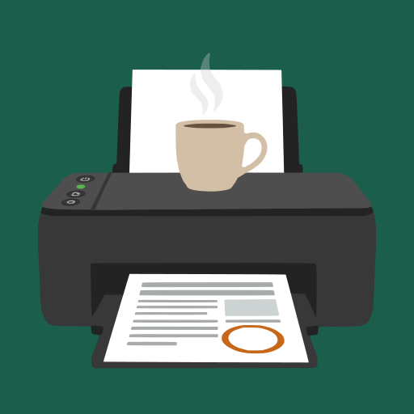
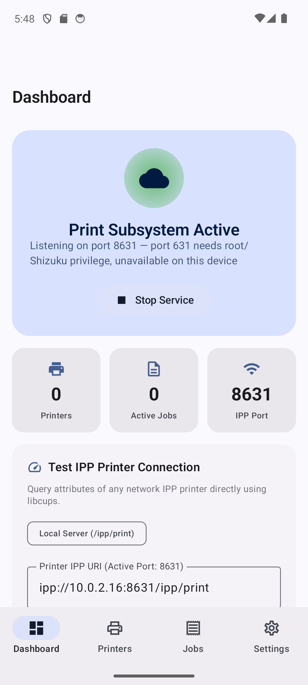
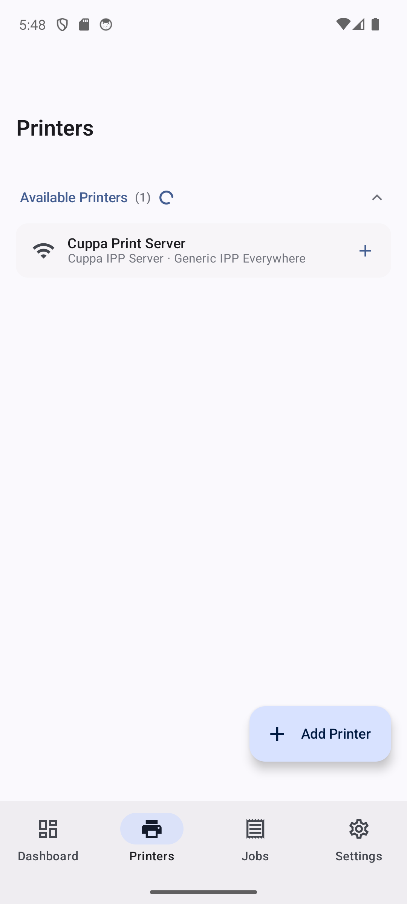
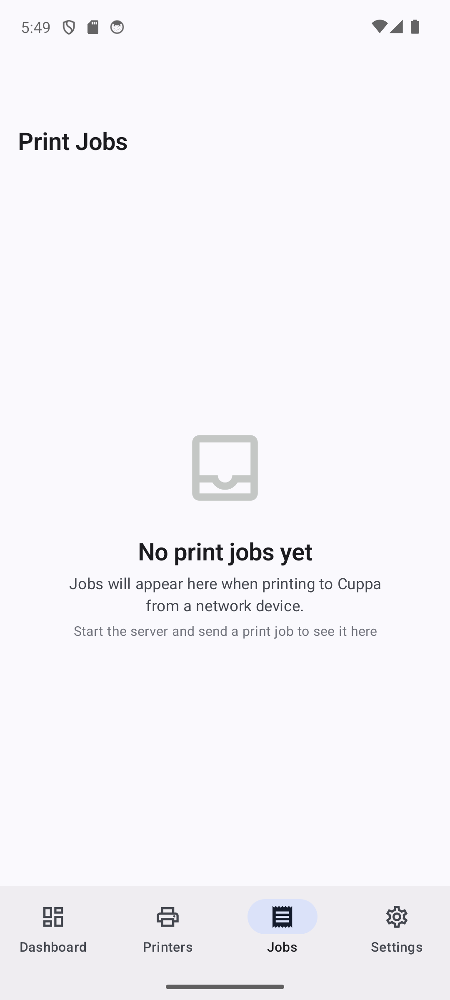
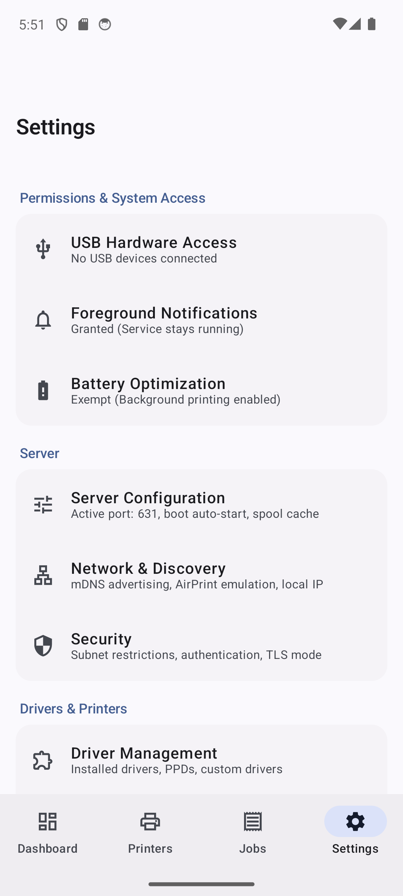

# Cuppa



I built Cuppa to turn my Android phone into a real local print server. There's no cloud account,
no WebView, and no vendor app locking you into one printer brand. It hosts a real CUPS based IPP
server right on the phone. Any Mac, Windows PC, iPhone, or iPad on the same network can find it
and print to it like a normal network printer, with no driver install needed on the other end.

I don't have much coding experience myself. Claude (Anthropic's AI) wrote and debugged nearly all
of the code here. I directed the work, tested it on real printers, and made the calls on what to
build and how it should feel. I don't want to take credit that isn't mine.

## Screenshots

<p float="left">
  
  
  
  
</p>

## What it does

- Driverless network printing. IPP Everywhere, AirPrint, Mopria. Cuppa advertises itself over mDNS
  so it just shows up in the system print dialog on macOS, Windows, iOS, and Linux.
- USB thermal and label printer support. Native ESC/POS, ZPL, EPL2, and TSPL drivers. Calibrated
  against real hardware including the Rollo X1038. Darkness, speed, dithering, and polarity are
  real settings that actually apply to the printed output.
- Network printer passthrough. Add any existing IPP or AirPrint printer to Cuppa's queue. Converts
  PDF to PWG-Raster automatically for printers that don't have an onboard PDF interpreter.
- TLS and IPPS. Optional encrypted printing. Self-signed cert generated on first use.
- Persistent job history. The Jobs tab shows active and finished jobs, both jobs Cuppa sends out
  and jobs other devices send to it.
- Native Material 3 UI. Built in Jetpack Compose. No WebView anywhere.

## Architecture

Cuppa embeds a ported CUPS 2.2.9 client library compiled for Android through the NDK, plus a
statically linked OpenSSL build for real TLS on both the client and server side. The native layer
handles IPP protocol logic and PDF to PWG-Raster conversion. The Kotlin and Compose layer handles
the UI, mDNS advertising through Android's NsdManager, USB device I/O, and job dispatch.

- `app/` is the Android application. UI, services, printer and job management, thermal driver
  dispatch, network discovery.
- `cups-core/` is the native CUPS engine module. Ported libcups C sources, JNI bridge, thermal
  printer command language encoders (ESC/POS, ZPL, EPL2, TSPL, PCL).

## Requirements

- Android 8.0 (API 26) or later.
- A local Wi-Fi network shared with whatever you're printing from.

## Installing

Grab the latest APK from the [Releases](../../releases) page. Or point
[Obtainium](https://github.com/ImranR98/Obtainium) at this repo and let it track new releases for
you. Cuppa also has its own in-app updater under Settings that can check for and install new
releases directly, no separate app needed.

Since this isn't on the Play Store, Android will ask you to allow installs from wherever you're
installing it (Cuppa itself, your browser, your file manager). That's normal for APKs distributed
outside a store.

## Building from source

```bash
git clone https://github.com/modnite/Cuppa.git
cd Cuppa
./gradlew :app:assembleDebug
```

You need the Android NDK for the native CUPS and OpenSSL build. Gradle installs it automatically
if the SDK's NDK component is available. Otherwise grab it through Android Studio's SDK Manager.

A release build also needs a signing keystore. Copy `keystore.properties.example` to
`keystore.properties` and fill in your own values. That file is gitignored so it never leaves your
machine.

## License

Check the individual source headers. The ported CUPS sources keep their original Apache 2.0
licensing from the AOSP/CUPS project.
